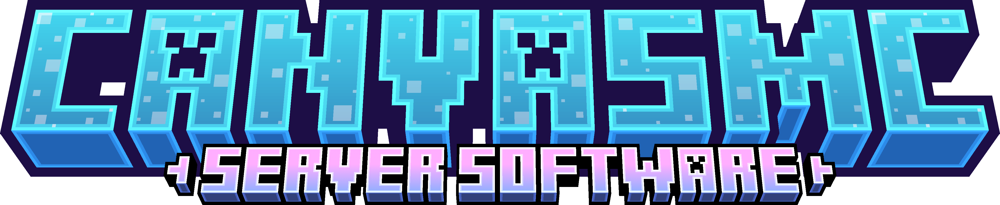

  
  
  

**CanvasMC** is a high-performance fork of the Folia Minecraft server software. It addresses gameplay inconsistencies and bugs, while introducing performance optimizations and enhancements to the dedicated server.

---

---

## Compatibility & Notes

* Canvas is a fork of **Folia** and is *not* a drop-in replacement for Purpur, Paper, or other non-Folia forks. It is intended primarily for environments already using Folia or Folia-based forks.
* The project adheres strictly to Folia’s threading and safety rules and does *not* permit bypassing them.

---

## License

This project is licensed under the **GNU General Public License v3.0 (GPL-3.0)**.

---
